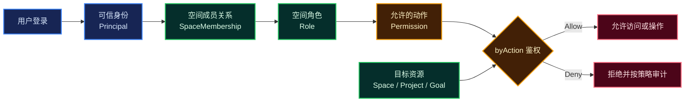

# Molis Auth

> 面向 Molis AI 产品的统一账号、空间成员与权限服务。


Molis Auth 解决三个基础问题：

1. **你是谁**：识别登录用户，并向服务端提供可信身份；
2. **你属于哪里**：管理个人空间、团队空间及其成员关系；
3. **你能做什么**：根据角色和权限，判断用户能否访问或操作目标资源。

它计划作为 Molis AI 各产品共用的身份与授权基础服务。首个设计场景来自 GoalBoard：让不同用户在个人空间或团队空间中安全地查看、创建和推进各自有权访问的项目。

## 核心能力

| 能力 | 解决的问题 | 核心概念 |
|---|---|---|
| 账号与认证 | 当前请求由谁发起，身份是否可信 | `User`、`Credential`、`AuthSession`、`Principal` |
| 空间管理 | 资源属于个人还是团队，权限边界在哪里 | `Personal Space`、`Team Space` |
| 成员与所有权 | 哪些用户属于某个空间，在其中是什么角色 | `SpaceMembership`、`Owner` |
| 角色与授权 | 当前用户能否对目标资源执行某项动作 | `Role`、`Permission`、`byAction` |
| 资源访问 | 用户能够查看和操作哪些项目及下游资源 | `Project`、`Goal`、`Session` |
| 审计与安全 | 谁在何时对什么执行了什么敏感操作 | `AuditEvent` |

## 它如何工作



当前方案采用 **Space 单层授权**：角色分配在 `SpaceMembership` 上，Project 继承所属 Space 的权限。本期不建立 Project 级角色，也不合并不同 Space 的权限。

## 面向产品提供的权限能力

| 能力 | 用途 |
|---|---|
| 操作鉴权 | 用户执行读取、创建、修改、删除、推进或审批前，通过 `byAction` 得到 `Allow / Deny` |
| 页面与按钮显隐 | 返回当前上下文的 `allowedActions`，帮助客户端展示可用操作 |
| 权限详情展示 | 展示角色、权限目录、角色权限矩阵和成员的有效权限 |
| 角色或权限修改 | 调整空间成员角色；未来按需开放角色权限组合配置 |

页面显隐只用于改善交互体验。真正的业务操作仍必须在服务端重新鉴权，不能依赖客户端隐藏按钮保证安全。

## 当前状态

项目处于**协议适配与基础实现**阶段，尚未完成 Auth/SDK 交付。详细证据见 [开发进度](docs/implementation-status.md)。

| 已完成 | 尚未实现 |
|---|---|
| 授权码兑换/刷新、本地登录、账号确认/浏览器绑定、邮箱注册/找回及本人会话管理 | 第三方身份关联入口及生产验收 |
| 双身份鉴权、页面动作与分页前过滤、服务身份、平台配置管理 HTTP/网页、部署初始化 | Owner 交接范围确认与生产接入验收 |
| 邮箱证明、受保护邮件投递、共享限流和离线常见密码检查 | 真实 SMTP 和生产参数验收 |
| MySQL/Flyway/MyBatis 空间、成员、邀请、归档及审计事务 | Owner 交接范围待确认，生产邮件待验收 |
| Vue 双语认证/平台/空间/会话安全页、外部身份解绑、邮件重发、共享限流、活动上报、浏览器 SDK、Java Starter 与独立业务示例，463 项测试 | 第三方身份关联/主动绑定、邮箱补验证、完整 OpenAPI、页面及生产部署验收 |
| Google/Apple 验签、授权码客户端、Apple 签名、配置/HTTP/Cookie、页面及 SDK 入口 | 完整 Provider 登录仍未交付，默认关闭，详见 [适配边界](docs/external-identity.md) |
| 逐项确认的 V1 决策记录 | 真实 Google/Apple/SMTP 联调及审计 |

> 默认开放 GET /actuator/health 与受协议校验保护的 POST /oauth2/token，其余请求默认拒绝。
> 同时开启 AUTH_LOGIN_ENABLED 和 AUTH_EPHEMERAL_ENABLED 后，可用本地密码/恢复认证事务及受限 CORS；真实 HTTP 密码至 Token 链路已验证。
> 另开启 AUTH_MAIL_ENABLED 并配置邮件可用注册/找回；通过 web profile 打包已有认证页面。SDK 与完整管理/授权能力未交付，暂不可作为完整服务接入产品。见 [网页运行说明](docs/web-ui.md)、[登录协议](docs/login-protocol.md) 与 [邮箱账号 API](docs/mailbox-account-api.md)。

浏览器 SDK 的本地构建、托管/自定义登录、刷新和退出用法见 [SDK 说明](sdk/browser/README.md)。
Auth 完成页需明确确认账号和目标应用，并校验浏览器绑定；已通过本机跨来源 SDK 浏览器验收，见 [登录确认合同](docs/login-confirmation.md)。
macOS 公共客户端登记、系统登录会话、PKCE 与进程重开策略见 [原生接入协议](docs/native-client-protocol.md)；本期不开发原生 App/CLI SDK。
后端只需引入 [Java Starter](sdk/java/README.md) 并配置 Auth 服务身份；[独立 MyBatis/MySQL 示例](sdk/java/example-service/README.md) 展示可信资源归属、SQL 授权过滤与执行时复核。Java 包已本地构建，未对外发布。
当前身份与退出 API 见 [自身账号接口](docs/self-account-api.md)。可用 `-Pweb,browser-sdk` 同时构建网页与 SDK；不会发布 npm 包。
后端服务凭据、短期服务 Token、轮换/禁用及未完成边界见 [服务身份](docs/service-identity.md)。不预置服务 Secret。
部署白名单及应用/客户端/凭据/用户启停/审计 HTTP 接口见 [平台管理 API](docs/platform-api.md)。
平台页面及空库初始化见 [控制台部署说明](docs/console.md)：显式开启 `AUTH_CONSOLE_ENABLED`，正常注册后由部署方指定管理员 userId，不自动提权。
普通账号的团队、成员、邮箱邀请/站内接受、归档恢复及空间审计见 [空间 API](docs/space-api.md)，不要求平台管理员身份。
业务后端的双 Token 请求、byAction、allowedActions、可访问空间范围和故障语义见 [资源鉴权 API](docs/authorization-api.md)。业务服务仍须解析可信资源归属并执行结果。

## 技术基线

| 项目 | 选择 |
|---|---|
| Java | JDK 21 |
| Spring Boot | 4.1.1 |
| 构建工具 | Maven Wrapper |
| 打包方式 | Jar |
| Group ID | `ai.molis` |
| Artifact ID | `auth` |
| 基础包名 | `ai.molis.auth` |

已接入 Spring Security 7.1.1、MyBatis Starter 4.1.0、MySQL 驱动和 Flyway（框架依赖版本由 Boot 管理）。
其余已确认技术与交付边界见 [V1 决策与计划](docs/auth-v1-plan.md)。

## 快速开始

### 环境要求

- JDK 21；
- macOS、Linux 或 Windows；
- 不需要预先安装 Maven，仓库已包含 Maven Wrapper。

确认 Java 版本：

```bash
java -version
```

### 构建与测试

macOS 或 Linux：

```bash
./mvnw test
```

Windows：

```powershell
mvnw.cmd test
```

### 启动项目

包含 Vue 页面的 Jar 使用 `./mvnw -B -ntp clean -Pweb package` 构建（需要 Node 22.18+ 与 npm）。
普通 `./mvnw test` 不依赖 Node；分离开发、前后端 origin 配置及页面路由见 [网页运行说明](docs/web-ui.md)。

先在 IDE 环境变量或外部配置中提供 AUTH_DB_URL、AUTH_DB_USER、AUTH_DB_PASSWORD，
指向专门的 Auth 开发库。启动会执行 Flyway 迁移；不要指向业务库或生产库。
例如 JDBC URL 为 jdbc:mysql://127.0.0.1:3306/auth_dev?connectionTimeZone=UTC。
仓库不包含数据库密码。普通 ./mvnw test 不需要数据库。

默认仅绑定 127.0.0.1，AUTH_ISSUER 默认 http://localhost:8080。本机 HTTP 仅用于 loopback 开发连接；
跨机器部署须提供 HTTPS issuer 和安全传输，不能仅放宽绑定地址就对外发布。
反向代理的受信任转发配置与部署验收尚待完成，当前不信任任意 X-Forwarded-* 头。
连接池强制 JDBC 与 MySQL 会话使用 UTC，避免到期时间随数据库机器时区漂移；不要用 URL 覆盖这些时间约束。

macOS 或 Linux：

```bash
./mvnw spring-boot:run
```

Windows：

```powershell
mvnw.cmd spring-boot:run
```

### 真实 MySQL 集成测试

仅使用已创建的本机隔离测试库（库名必须以 auth_test_ 开头）。账号通过 AUTH_TEST_DB_USER、
AUTH_TEST_DB_PASSWORD 环境变量提供。以下端口和库名替换为自己的测试实例：

```bash
./mvnw -B -ntp -Pmysql-it \
  '-Dauth.it.jdbc-url=jdbc:mysql://127.0.0.1:43316/auth_test_example?connectionTimeZone=UTC' verify
```

测试会迁移并写入测试库，不会 clean/drop 数据库。缺少测试库参数会失败，不能静默跳过验收。
普通测试结果位于 target/surefire-reports，集成测试结果位于 target/failsafe-reports。

### Redis 与账号联动测试

使用专门的 loopback Redis 测试实例（非默认 6379），同时准备上述 MySQL 测试库：

```bash
./mvnw -B -ntp clean -Pfull-it \
  '-Dauth.it.jdbc-url=jdbc:mysql://127.0.0.1:43316/auth_test_example?connectionTimeZone=UTC' \
  -Dauth.it.redis-port=46379 verify
```

测试写入短期证明/事务键及共享限流键，不执行 FLUSHDB/FLUSHALL；当前测试实例须独立、仅 loopback、无密码、无 TLS，不能连接生产。
HTTP 测试使用真实 IP 限流，短时间连续多轮运行可能需等待窗口到期。
生产连接可配置 AUTH_REDIS_HOST/PORT/USER/PASSWORD/TLS；AUTH_EPHEMERAL_ENABLED=true 才加载当前 Redis 工作流。
AUTH_LOGIN_ENABLED=true 另行加载本地密码/恢复 HTTP 入口与已打包认证页面；邮箱注册/重置/确认还依赖 AUTH_MAIL_ENABLED 和有效邮件配置。开启开关不代表完整服务可上线。
新密码默认采用有限离线常见密码快照，可通过 AUTH_PASSWORD_BLOCKLIST_FILE 追加整值摘要列表；配置损坏启动失败，说明见邮箱账号 API 文档。
邮件默认禁用；投递、密钥轮换、显式开发收件箱及 SMTP 配置见 [邮件运行说明](docs/mail-delivery.md)。

## 项目结构

```text
.
├── docs/
│   ├── auth-v1-plan.md                       # 已确认实施基线
│   ├── implementation-status.md              # 开发进度与证据
│   └── account-space-permission-solution.md  # 历史宏观方案
├── src/
│   ├── main/
│   │   ├── java/ai/molis/auth/               # 安全、权限、会话规则和存储映射
│   │   └── resources/                        # 应用配置与 Flyway 迁移
│   └── test/                                 # 单元、协议和真实 MySQL 集成测试
├── .java-version                             # JDK 21
├── mvnw / mvnw.cmd                           # Maven Wrapper
└── pom.xml                                   # 构建与依赖配置
```

## 设计文档

完整领域模型、模块边界、权限作用域、Authorizer 决策流程和实施分期见：

- [V1 决策与开发计划（实施基线）](docs/auth-v1-plan.md)
- [当前开发进度与验证证据](docs/implementation-status.md)
- [历史账号、空间与权限方案](docs/account-space-permission-solution.md)

## 边界说明

Molis Auth 管理的是产品自身的登录身份、空间成员关系和资源权限。GitHub、Gmail 等外部连接账号及其 Token 仍属于各产品的 Connector 和 SecretStore，不属于本服务的用户登录凭据。
