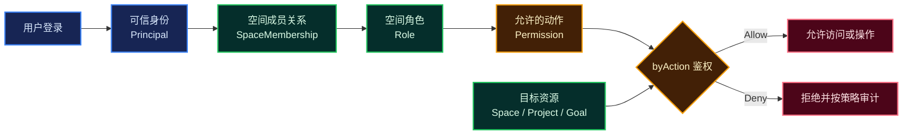

# Molis Auth

> 面向 Molis AI 产品的统一账号、空间成员与权限服务。


Molis Auth 解决三个基础问题：

1. **你是谁**：识别登录用户，并向服务端提供可信身份；
2. **你属于哪里**：管理个人空间、团队空间及其成员关系；
3. **你能做什么**：根据角色和权限，判断用户能否访问或操作目标资源。

它计划作为 Molis AI 各产品共用的身份与授权基础服务。首个设计场景来自 GoalBoard：让不同用户在个人空间或团队空间中安全地查看、创建和推进各自有权访问的项目。

## 核心能力

| 能力 | 解决的问题 | 核心概念 |
|---|---|---|
| 账号与认证 | 当前请求由谁发起，身份是否可信 | `User`、`Credential`、`AuthSession`、`Principal` |
| 空间管理 | 资源属于个人还是团队，权限边界在哪里 | `Personal Space`、`Team Space` |
| 成员与所有权 | 哪些用户属于某个空间，在其中是什么角色 | `SpaceMembership`、`Owner` |
| 角色与授权 | 当前用户能否对目标资源执行某项动作 | `Role`、`Permission`、`byAction` |
| 资源访问 | 用户能够查看和操作哪些项目及下游资源 | `Project`、`Goal`、`Session` |
| 审计与安全 | 谁在何时对什么执行了什么敏感操作 | `AuditEvent` |

## 它如何工作



当前方案采用 **Space 单层授权**：角色分配在 `SpaceMembership` 上，Project 继承所属 Space 的权限。本期不建立 Project 级角色，也不合并不同 Space 的权限。

## 面向产品提供的权限能力

| 能力 | 用途 |
|---|---|
| 操作鉴权 | 用户执行读取、创建、修改、删除、推进或审批前，通过 `byAction` 得到 `Allow / Deny` |
| 页面与按钮显隐 | 返回当前上下文的 `allowedActions`，帮助客户端展示可用操作 |
| 权限详情展示 | 展示角色、权限目录、角色权限矩阵和成员的有效权限 |
| 角色或权限修改 | 调整空间成员角色；未来按需开放角色权限组合配置 |

页面显隐只用于改善交互体验。真正的业务操作仍必须在服务端重新鉴权，不能依赖客户端隐藏按钮保证安全。

## 当前状态

项目处于 **Bootstrap** 阶段：仓库已经具备可构建、可启动的 Spring Boot 工程骨架，但尚未实现业务逻辑。

| 已完成 | 尚未实现 |
|---|---|
| JDK 21 与 Maven Wrapper | 登录、退出和登录会话 |
| Spring Boot 启动入口 | User、Space、Membership 等领域实体 |
| Web MVC、Validation、Actuator 基础依赖 | Role、Permission 和 Authorizer |
| 基础上下文启动测试 | 数据库和迁移脚本 |
| 宏观领域与权限方案 | 对外业务接口和审计能力 |

> 当前启动成功只表示工程骨架工作正常，不代表认证或鉴权功能已经可用。

## 技术基线

| 项目 | 选择 |
|---|---|
| Java | JDK 21 |
| Spring Boot | 4.1.1 |
| 构建工具 | Maven Wrapper |
| 打包方式 | Jar |
| Group ID | `ai.molis` |
| Artifact ID | `auth` |
| 基础包名 | `ai.molis.auth` |

Spring Security、数据库驱动和迁移工具将在对应详细方案确认后引入，避免在领域边界尚未确定时提前固化实现。

## 快速开始

### 环境要求

- JDK 21；
- macOS、Linux 或 Windows；
- 不需要预先安装 Maven，仓库已包含 Maven Wrapper。

确认 Java 版本：

```bash
java -version
```

### 构建与测试

macOS 或 Linux：

```bash
./mvnw test
```

Windows：

```powershell
mvnw.cmd test
```

### 启动项目

macOS 或 Linux：

```bash
./mvnw spring-boot:run
```

Windows：

```powershell
mvnw.cmd spring-boot:run
```

## 项目结构

```text
.
├── docs/
│   └── account-space-permission-solution.md  # 宏观方案
├── src/
│   ├── main/
│   │   ├── java/ai/molis/auth/               # Spring Boot 启动入口
│   │   └── resources/                        # 应用配置
│   └── test/                                 # 工程启动测试
├── .java-version                             # JDK 21
├── mvnw / mvnw.cmd                           # Maven Wrapper
└── pom.xml                                   # 构建与依赖配置
```

## 设计文档

完整领域模型、模块边界、权限作用域、Authorizer 决策流程和实施分期见：

- [账号、空间与权限方案](docs/account-space-permission-solution.md)

## 边界说明

Molis Auth 管理的是产品自身的登录身份、空间成员关系和资源权限。GitHub、Gmail 等外部连接账号及其 Token 仍属于各产品的 Connector 和 SecretStore，不属于本服务的用户登录凭据。
