# GoalBoard 账号、空间与权限方案

> 历史宏观方案。2026-09-14 起实施以 [Auth V1 决策与开发计划](auth-v1-plan.md) 为准。
> 主要修订：Auth 不保存 Project Catalog；Team Space 唯一 Owner；V1 无项目转移和账号永久注销；加入 Google/Apple、邮件邀请/验证/找回密码、SDK 和管理页面。

状态：基于当前讨论形成的新一版宏观方案，用于团队评审和后续模块详细设计。

## 1. 方案结论

GoalBoard 当前已经具备 Project、Goal、Session、Feed、Planning 和 Runtime 协作能力，但没有正式的应用账号、空间成员体系和统一资源授权能力。

本方案增加一套以 `User`、`Space`、`SpaceMembership`、`Role`、`Permission` 和 `Project` 为核心的控制面，实现：

- 用户可以登录并获得服务端确认的可信身份；
- 每个用户自动拥有一个 Personal Space；
- 多个用户可以通过 SpaceMembership 加入一个 Team Space；
- 每条 SpaceMembership 记录用户在该 Space 中的 Role；
- Project 必须且只能属于一个 Space；
- 用户对 Project 及其业务资源的访问由统一 Authorizer 判断；
- 账号、成员、角色、权限和项目归属变更进入统一审计。

本期采用以下简化决定：

1. **不建立独立 Team 实体。** Team Space 直接使用 `space.type = team` 表达。
2. **Membership 明确为 SpaceMembership。** 它直接连接 User 和 Space。
3. **一条 SpaceMembership 首期只分配一个 Role。** 暂不引入多角色叠加。
4. **Project 权限继承 Space 权限。** 首期不建立项目级权限覆盖。
5. **Runtime 委托不属于本期核心方案。** Runtime 未来只作为 Authorizer 的使用方接入。
6. **本期目标仍是单实例、多账号、按空间授权。** 架构边界兼容未来本地客户端和远程服务端分离。

---

## 2. 设计范围

### 2.1 本期包含

- 应用账号的创建、查询、修改、禁用和注销；
- 登录、退出、当前用户识别和登录 Session 管理；
- Personal Space 和 Team Space；
- Space 成员的增加、移除、查询、角色调整和 Owner 转移；
- Role、Permission 和统一 Authorizer；
- Project 的 Space 归属、CRUD、权限过滤和历史数据迁移；
- Goal、Session、Feed、Planning 等项目入口的授权接入；
- 账号、成员、权限和项目归属相关的安全审计；
- 越权测试、迁移测试和端到端验证。

### 2.2 本期不包含

- 独立的 Team 或 Organization 实体；
- Runtime Delegation 的签发、期限、权限上限和撤销机制；
- 项目级独立成员和项目级权限覆盖；
- 一个 SpaceMembership 同时拥有多个 Role；
- 一个 Project 同时属于多个 Space；
- 跨 Space 共享同一个 Project；
- 邮件邀请、邀请链接、SSO、LDAP、MFA 和企业身份源；
- 手机号登录和找回密码；
- 团队计费、多设备实时同步和云端 SaaS 多租户；
- 复杂 ABAC 或条件权限表达式；
- 将 GitHub、Gmail 等外部连接账号并入 GoalBoard 应用账号。

---

## 3. 核心术语

| 概念 | 定义 | 关键说明 |
|---|---|---|
| `User` | 可以登录 GoalBoard 的应用用户 | 不等于 GitHub/Gmail 外部账号，也不等于 Runtime |
| `Credential` | 用于证明 User 身份的密码或其他登录凭据 | 保存密码哈希或凭据引用，不保存明文密码 |
| `AuthSession` | User 一次独立登录产生的登录会话 | 与 GoalBoard 工作 Session、Runtime Session 不同 |
| `Principal` | 服务端根据可信登录凭据解析出的当前权限主体 | 是运行时安全上下文，不由客户端直接声明 |
| `Space` | 项目资源的归属和授权边界 | `type` 至少包括 `personal` 和 `team` |
| `SpaceMembership` | User 在某个 Space 中的成员关系 | 记录 `user_id`、`space_id`、`role_id`、状态和加入时间 |
| `Role` | 一组 Permission 的命名集合 | 首期包括 Owner、Admin、Member、Viewer |
| `Permission` | 允许对某类资源执行的具体动作 | 使用 `resource.action` 形式，例如 `project.read` |
| `Authorizer` | 根据 Principal、资源归属、成员关系和 Permission 作出允许或拒绝决定的服务 | 所有服务端入口必须共用 |
| `Project` | Space 中的具体业务项目 | 每个 Project 必须且只能属于一个 Space |
| `AuditEvent` | 对安全敏感操作和授权结果的统一记录 | 能回答谁在何时对什么执行了什么动作以及结果 |

### 3.1 必须区分的同名或相近概念

- 当前代码中的 Workspace 是本地文件系统工作目录，不是本方案中的 Space；
- 当前 Claim/Run 中的 executor、reviewer 等 Role 是 Goal 工作流角色，不是账号 RBAC Role；
- 当前 `actor_id` 是执行和审计字段，不是经过认证的 User 或 Principal；
- 当前 GoalBoard Session 是工作会话，不是用户登录 AuthSession；
- GitHub、Gmail 凭据继续属于 Feed/Connector 和 SecretStore，不属于 User Credential。

---

## 4. 核心领域模型

```mermaid
%%{init: {
  "theme": "dark",
  "themeVariables": {
    "fontFamily": "Inter, PingFang SC, Microsoft YaHei, sans-serif",
    "background": "#090e1a",
    "primaryColor": "#172033",
    "primaryTextColor": "#e5e7eb",
    "primaryBorderColor": "#475569",
    "secondaryColor": "#111827",
    "tertiaryColor": "#0f172a",
    "lineColor": "#94a3b8",
    "clusterBkg": "#0f172a",
    "clusterBorder": "#334155",
    "edgeLabelBackground": "#111827"
  },
  "flowchart": {
    "curve": "basis",
    "nodeSpacing": 42,
    "rankSpacing": 56
  }
}}%%

flowchart TB

    subgraph identity["① 账号与认证"]
        direction LR

        user["User｜GoalBoard 登录用户"]
        credential["Credential｜登录凭据"]
        authSession["Auth Session｜独立登录会话"]
        principal["Principal｜服务端确认的可信身份"]

        user -->|"一个用户可以持有多种登录凭据"| credential
        user -->|"每次独立登录创建一条会话"| authSession
        authSession -->|"校验成功后解析身份"| principal
        principal -->|"代表这个用户"| user
    end

    subgraph spaceDomain["② 空间与成员"]
        direction LR

        subgraph spaceBoundary["Space｜资源归属与权限边界"]
            direction TB

            personalSpace["Personal Space｜个人空间"]
            teamSpace["Team Space｜团队 / 项目组空间"]
        end

        spaceMembership["SpaceMembership｜User 在某个 Space 中的成员记录"]

        user -->|"membership.user_id 指向登录用户"| spaceMembership
        personalSpace -->|"注册时自动创建唯一 Owner 记录"| spaceMembership
        teamSpace -->|"每加入一个用户创建一条成员记录"| spaceMembership
    end

    subgraph resourceDomain["③ 项目业务资源"]
        direction LR

        project["Project｜只属于一个 Space"]
        goal["Goal｜目标与依赖"]
        workSession["GoalBoard Session｜工作会话"]
        feed["Feed / Connector｜项目外部输入"]
        planning["Planning｜说明、规则与规划"]

        personalSpace -->|"project.space_id 指向个人空间"| project
        teamSpace -->|"project.space_id 指向团队空间"| project

        project -->|"包含多个 Goal"| goal
        project -->|"关联多个工作会话"| workSession
        project -->|"包含多个 Feed 来源"| feed
        project -->|"包含一套项目规划"| planning
    end

    subgraph authorization["④ 角色、权限与鉴权"]
        direction LR

        role["Role｜Owner · Admin · Member · Viewer"]
        permission["Permission｜允许执行的具体动作"]
        authorizer(["Authorizer｜服务端统一鉴权"])
        decision["授权结果｜Allow / Deny"]
        audit["Audit Event｜鉴权与敏感操作记录"]

        role -->|"一个角色配置多个权限键"| permission
        permission -->|"提供可执行动作"| authorizer
        authorizer -->|"输出判断"| decision
        decision -.->|"保存结果"| audit
    end

    identity -->|"提供可信用户身份"| authorization
    spaceDomain -->|"提供空间、成员关系和角色范围"| authorization
    resourceDomain -->|"提供目标资源及空间归属"| authorization

    classDef identityNode fill:#172554,stroke:#3b82f6,stroke-width:2.5px,color:#dbeafe;
    classDef spaceNode fill:#052e2b,stroke:#22c55e,stroke-width:2.5px,color:#dcfce7;
    classDef authNode fill:#422006,stroke:#f59e0b,stroke-width:2.5px,color:#fef3c7;
    classDef serviceNode fill:#431407,stroke:#f97316,stroke-width:3.5px,color:#ffedd5;
    classDef decisionNode fill:#3f2b05,stroke:#facc15,stroke-width:3px,color:#fef9c3;
    classDef resourceNode fill:#4c0519,stroke:#fb7185,stroke-width:2.5px,color:#ffe4e6;
    classDef auditNode fill:#27213f,stroke:#c084fc,stroke-width:2px,color:#f3e8ff;

    class user,credential,authSession,principal identityNode;
    class spaceMembership,personalSpace,teamSpace spaceNode;
    class project,goal,workSession,feed,planning resourceNode;
    class role,permission authNode;
    class authorizer serviceNode;
    class decision decisionNode;
    class audit auditNode;

    style identity fill:#0b1633,stroke:#2563eb,stroke-width:2px,color:#dbeafe
    style spaceDomain fill:#071f1d,stroke:#16a34a,stroke-width:2px,color:#dcfce7
    style spaceBoundary fill:#0a2925,stroke:#22c55e,stroke-width:3px,color:#dcfce7
    style resourceDomain fill:#2c0a16,stroke:#e11d48,stroke-width:2px,color:#ffe4e6
    style authorization fill:#281704,stroke:#d97706,stroke-width:2px,color:#fef3c7
```



图中蓝色、绿色和红色分别向黄色提供身份、成员范围和目标资源。图中不展开 Authorizer 的逐实体查询线，以保持领域图可读；实际鉴权算法在第 8 节说明。

---

## 5. 六个模块

| 模块 | 要解决的问题 | 核心职责 | 主要实体 | 明确边界 |
|---|---|---|---|---|
| **M1 账号与认证** | 系统如何可靠知道“你是谁” | 账号 CRUD；凭据安全；登录退出；AuthSession 创建、校验、过期和撤销；解析 Principal | `user`、`credential`、`auth_session`；运行时 `principal` | 不管理空间成员、角色、项目权限和 Feed 外部账号 |
| **M2 空间管理** | 项目资源属于个人还是团队空间 | Personal Space 和 Team Space 的创建、查询、修改、归档；空间类型、名称、状态和资源边界 | `space` | 不建立独立 Team；不管理成员进出、角色权限和 Project 自身业务 |
| **M3 空间成员与所有权** | 哪些用户属于某个 Space，以及在该 Space 中是什么身份 | SpaceMembership CRUD；添加和移除成员；成员状态；角色调整；Owner 转移；最后一个 Owner 保护 | `space_membership` | 不管理登录凭据；不定义 Role 包含哪些 Permission；不保存 Project 业务数据 |
| **M4 角色与授权** | 某个 Principal 能否对某个资源执行某个动作 | Role 和 Permission；角色权限组合；有效权限计算；统一 Authorizer；Allow/Deny 决策 | `role`、`permission`、`role_permission`；Authorizer | 不承载资源业务；前端按钮状态不能替代服务端鉴权；不使用 `actor_id` 授权 |
| **M5 项目与资源访问** | 用户能看到和操作哪些 Project | Project CRUD；Project 唯一 Space 归属；授权项目查询；历史项目迁移；Goal、Session、Feed、Planning 接入鉴权 | 扩展后的 `project` | 不建立项目级第二套 Role/Permission；不复制 Goal 等项目事实 |
| **M6 审计与安全** | 谁在何时对什么执行了什么敏感动作，结果如何 | 账号、成员、角色、权限、所有权和项目归属变更审计；授权结果审计；安全事件查询 | `audit_event` | 不负责 Runtime 委托；不替代各业务模块自身的事件记录 |

### 5.1 模块依赖

1. M1 提供可信 `Principal`；
2. M2 提供 `Space` 和资源归属边界；
3. M3 连接 M1 的 User 与 M2 的 Space，并为成员保存 `role_id`；
4. M4 根据 Principal、SpaceMembership、Role、Permission 和资源归属统一鉴权；
5. M5 声明 Project 的 `space_id`，并使用 M4 过滤查询和保护操作；
6. M6 记录 M1～M5 产生的安全敏感变化和鉴权结果。

推荐详细设计顺序为：M1 与 M2 并行确定基础契约，随后依次设计 M3、M4、M5，最后完成 M6 和全链路验证。

---

## 6. 核心关系与不变量

### 6.1 User 与登录

- 一个 User 可以有多个 Credential；
- 一个 User 在不同时间、设备或客户端登录，可以产生多个 AuthSession；
- 页面刷新或同一会话内的普通请求不能重复创建 AuthSession；
- Principal 必须由服务端根据有效 AuthSession 或等价可信凭据解析；
- 客户端提交的 `user_id`、`actor_id` 不能直接成为 Principal。

### 6.2 User、Space 与 SpaceMembership

- 每个 User 必须拥有且只能拥有一个 Personal Space；
- 创建 User 时，系统必须同时创建 Personal Space 和不可移除的 Owner SpaceMembership；
- Team Space 可以包含多个 SpaceMembership；
- 每条 SpaceMembership 必须且只能关联一个 User 和一个 Space；
- 同一 User 在同一 Space 中最多存在一条有效 SpaceMembership；
- 一个 User 可以通过不同 SpaceMembership 加入多个 Team Space；
- 每个有效 Space 必须至少保留一个 Owner；
- Personal Space 的 Owner 不能被移除或降级；
- Team Space 的最后一个 Owner 不能被移除或降级。

### 6.3 SpaceMembership、Role 与 Permission

- 一条 SpaceMembership 首期只保存一个 `role_id`；
- 多条 SpaceMembership 可以引用同一个 Role；
- Role 不是 User 的无边界全局属性，只能通过明确的 SpaceMembership 生效；
- Role 通过 RolePermission 包含多个 Permission；
- 一个 Permission 可以被多个 Role 使用；
- 被有效 SpaceMembership 使用的 Role 不能直接删除；
- 自定义 Role 不能绕过 Owner 保护、审计和资源归属不变量。

### 6.4 Space 与 Project

- 一个 Space 可以包含多个 Project；
- 一个 Project 必须且只能属于一个 Space；
- Project 通过 `space_id` 声明归属；
- Project 默认继承 SpaceMembership 对应 Role 的权限；
- 首期不支持 Project 级成员、Project 级 Role 或权限覆盖；
- Project 转移必须从一个 Space 原子地变更到另一个 Space，并写入审计；
- Goal、Session、Feed 和 Planning 继续属于 Project 业务，不迁入账号控制面。

---

## 7. 角色和权限基线

### 7.1 首期内置角色

| Role | 定位 | 典型能力 |
|---|---|---|
| Owner | Space 最终所有者 | 管理 Space、成员、角色和项目；转移所有权；删除或归档 Space |
| Admin | 日常管理者 | 管理成员和项目；不能移除最后一个 Owner 或绕过所有权约束 |
| Member | 普通协作者 | 读取和使用 Space 中的 Project，按权限推进项目工作 |
| Viewer | 只读成员 | 读取 Space、Project 及允许公开的项目业务数据 |

### 7.2 首批 Permission 域

权限键使用 `resource.action` 形式，至少覆盖：

- 账号：`user.read`、`user.update`、`user.disable`；
- 空间：`space.read`、`space.update`、`space.archive`；
- 成员：`space.member.read`、`space.member.manage`、`space.owner.transfer`；
- 角色：`role.read`、`role.manage`；
- 项目：`project.read`、`project.create`、`project.update`、`project.delete`、`project.transfer`；
- Goal：`goal.read`、`goal.advance`、`goal.approve`；
- Session：`session.read`、`session.manage`；
- Feed：`feed.read`、`feed.manage`；
- Planning：`planning.read`、`planning.update`。

角色与 Permission 的最终矩阵应在 M4 详细方案中单独确认。本方案只确定权限模型和首批资源域。

### 7.3 Role 的作用域决定

| 问题 | 本期决定 | 说明 |
|---|---|---|
| Role 在哪里定义 | 系统级定义 | Owner、Admin、Member、Viewer 是可复用的角色模板 |
| Role 在哪里分配 | `SpaceMembership` | 用户加入某个 Space 时，在该成员关系上获得一个 Role |
| Role 在哪里生效 | 当前 Space 及其所属资源 | Role 只影响该 Space，以及 `space_id` 指向该 Space 的 Project 和下游资源 |
| Project 是否单独分配 Role | 否 | 本期不建立 ProjectMembership、ProjectRole 或项目级覆盖 |
| Project 如何获得权限 | 继承所属 Space | 先由 Project 找到 `space_id`，再查询用户在该 Space 中的 Membership 和 Role |
| 多个 Space 的角色是否合并 | 否 | 访问某个 Project 时，只计算其所属 Space 中的 Role，不能拿其他 Space 的权限来补足 |
| Space 权限和 Project 权限是否取并集 | 否 | 本期只有 Space 权限来源，不存在需要求并集的第二套 Project 权限 |

选择 Space 单层授权的原因：当前 Project 必须且只能属于一个 Space，团队协作边界也以 Space 为单位。在没有明确“同一 Space 内不同 Project 必须使用不同成员或角色”的业务场景前，下沉项目级权限会引入第二套成员关系、冲突优先级、列表过滤和审计复杂度。

如果未来确实出现项目保密、外部协作者只参与单个项目等需求，应单独设计 Project 级授权模型及其优先级；不能简单把 Space 与 Project 权限取并集，因为取并集会让较宽的一侧扩大最终权限，容易造成越权。

---

## 8. Authorizer 鉴权算法

Authorizer 接收：

```text
principal
resource_type
resource_id
action
```

以访问 Project 为例，服务端必须按以下顺序判断：

1. 校验 Principal 是否存在、有效且对应启用状态的 User；
2. 根据 `resource_id` 读取 Project；
3. 从 Project 读取唯一的 `space_id`；
4. 使用 `principal.user_id + project.space_id` 查询有效 SpaceMembership；
5. 如果不存在有效成员关系，返回 Deny；
6. 从 SpaceMembership 读取 `role_id`；
7. 查询 Role 包含的 Permission；
8. 检查 Permission 是否包含本次 `action`；
9. 应用 Owner 保护、资源状态等强制约束；
10. 返回 Allow 或 Deny，并按审计策略记录结果。

伪代码：

```text
authorize(principal, "project", project_id, action):
  require principal is trusted and user is active

  project = find_project(project_id)
  membership = find_active_membership(
    user_id = principal.user_id,
    space_id = project.space_id
  )

  if membership does not exist:
    return Deny

  permissions = permissions_of(membership.role_id)

  if action not in permissions:
    return Deny

  if mandatory_constraint_failed:
    return Deny

  return Allow
```

所有 Project 列表查询同样必须基于 Principal 做权限过滤，不能先返回全量项目再由前端隐藏。

---

## 9. 数据边界

### 9.1 全局控制面数据库

建议保存：

- `users`；
- `credentials`；
- `auth_sessions`；
- `spaces`；
- `space_memberships`；
- `roles`；
- `permissions`；
- `role_permissions`；
- Project Catalog 及新增的 `space_id`、`created_by`；
- `audit_events`。

账号、成员、角色和项目归属需要跨项目查询并保证事务一致性，因此应位于同一个全局控制面，而不是分散进各项目数据库。

### 9.2 每项目数据库

继续保存：

- Goal、Relation 和 Contract；
- Claim、Run、Evidence 和 Review；
- Guidance 和 Planning；
- Feed 和项目输入；
- 其他项目内部事实。

账号体系只保护这些资源，不接管或复制它们。

### 9.3 SecretStore

GitHub、Gmail 等 Connector 凭据继续保存在现有 SecretStore。它们不能作为 GoalBoard 登录凭据，也不能隐式授予 Space 或 Project 权限。

---

## 10. 权限模块需要提供的接口能力

本期只定义四类权限接口能力，不展开通信协议、URL、请求方法和具体字段。

### 10.1 四类接口能力

| 类别 | 接口能力 | 使用场景 | 核心输入 | 核心输出 | 模块归属 |
|---|---|---|---|---|---|
| 1. 操作鉴权 | `byAction`：判断当前用户能否对目标资源执行某项动作 | 用户读取、创建、修改、删除、推进或审批资源之前 | 服务端 Principal、目标 Resource、Action | `Allow / Deny`；必要时附稳定的拒绝原因 | 判断能力属于 M4；具体业务接口仍属于各业务模块 |
| 2. 页面与按钮显隐 | 查询当前用户在指定 Space 或资源上的可用动作 | 页面初始化、菜单展示、按钮启用和操作提示 | 服务端 Principal、当前 Space 或 Resource | `allowedActions`，必要时附当前 Role 摘要 | M4 |
| 3. 权限详情展示 | 查询角色、权限目录、角色权限矩阵和成员的有效权限 | 管理员查看权限配置；成员查看自己为什么能或不能操作 | 查询范围、Role、Membership 或 User | Role、Permission 及有效权限详情 | M4 提供权限详情；M3 提供成员及其角色信息 |
| 4. 角色或权限修改 | 为 Space 成员调整 Role，或调整 Role 包含的 Permission | 成员管理和权限配置 | 目标 Membership 或 Role、变更内容 | 修改结果和审计标识 | 修改 Membership Role 属于 M3；修改 RolePermission 属于 M4 |

### 10.2 四类能力的必要边界

| 类别 | 本期需要做到 | 不应承担的职责 |
|---|---|---|
| `byAction` 操作鉴权 | 所有受保护的服务端业务操作在执行前强制调用；无身份、无 Membership 或无 Permission 时默认拒绝 | 不负责真正创建、修改或删除业务资源 |
| 页面与按钮显隐 | 一次返回当前上下文的 `allowedActions`，由客户端统一控制界面 | 不能代替业务接口自己的服务端鉴权，不能只靠 Role 名称硬编码按钮 |
| 权限详情展示 | 支持查看内置角色、权限目录、角色权限矩阵以及成员在当前 Space 的有效权限 | 不向普通用户暴露敏感的内部鉴权过程和其他 Space 数据 |
| 角色或权限修改 | 校验操作者权限、Owner 保护和最后一个 Owner 约束；成功后写审计 | 普通角色修改不能隐式完成所有权转移，也不能绕过强制不变量 |

### 10.3 模块之间的最小协作

| 发起模块或场景 | 调用的权限能力 | 权限判断后由谁完成业务 |
|---|---|---|
| M2 修改或归档 Space | `byAction` | M2 修改 Space |
| M3 添加、移除成员或调整成员 Role | `byAction` | M3 修改 SpaceMembership |
| M5 创建、修改、删除或转移 Project | `byAction` | M5 修改 Project |
| Goal、工作 Session、Feed、Planning 操作 | `byAction` | 对应业务模块完成操作 |
| 页面初始化 | 页面与按钮显隐 | 客户端只调整展示状态 |
| 权限管理页面 | 权限详情展示 | 客户端展示 Role、Permission 和有效权限 |
| 成员管理页面修改 Role | 角色或权限修改 | M3 更新 Membership，M6 记录审计 |
| 未来开放自定义 Role | 角色或权限修改 | M4 更新 RolePermission，M6 记录审计 |

### 10.4 本期简化决定

| 决定 | 说明 |
|---|---|
| 不单独提供大量细粒度权限查询接口 | 页面显隐统一使用当前上下文的 `allowedActions` |
| 不要求客户端逐按钮调用 `byAction` | 页面初始化时批量获得可用动作，真正操作时由服务端再次鉴权 |
| 不开放自定义 Role 管理 | 首期固定使用 Owner、Admin、Member、Viewer；保留未来扩展位置 |
| 不开放 Project 级角色配置 | Project 完全继承所属 Space 的 Membership Role |
| 不对 Space 权限和 Project 权限求并集 | 本期不存在第二套 Project 权限来源 |

---

## 11. 历史数据迁移

首次升级时：

1. 创建或确认一个默认本地 User；
2. 为该 User 创建 Personal Space；
3. 创建该 User 在 Personal Space 中不可移除的 Owner SpaceMembership；
4. 初始化 Owner、Admin、Member、Viewer 和 Permission 目录；
5. 将所有历史用户 Project 的 `space_id` 设置为该 Personal Space；
6. 保留原 `project_id`、`board_id`、数据库路径和项目事实；
7. 保留历史 `actor_id`，无法映射的记录标记为 Legacy Actor，不伪造 User；
8. 记录迁移结果和异常；
9. 验证迁移可以重复检查，失败可以恢复。

迁移不得丢失 Goal、Session、Evidence、Feed 或 Planning 数据。

---

## 12. 实施分期

| 阶段 | 工作重点 | 主要交付 |
|---|---|---|
| 第一阶段：基础契约 | 确定 User、Space、SpaceMembership 主键、状态和不变量 | 领域模型、数据库迁移框架、服务契约 |
| 第二阶段：账号认证 | 实现账号、Credential、AuthSession 和 Principal | 登录退出、当前用户、Session 撤销、账号 CRUD |
| 第三阶段：空间成员 | 实现 Personal/Team Space、成员和 Owner 约束 | 自动个人空间、团队空间 CRUD、成员管理、所有权转移 |
| 第四阶段：角色授权 | 实现 Role、Permission、角色矩阵和 Authorizer | 内置角色、权限目录、Allow/Deny、越权测试 |
| 第五阶段：项目接入 | Project 增加 Space 归属，项目业务接入统一授权 | 授权项目查询、CRUD/转移、Goal/Session/Feed/Planning 保护 |
| 第六阶段：审计迁移 | 补齐审计、迁移和端到端验收 | AuditEvent、历史项目迁移、跨入口一致性和安全证据 |

---

## 13. 验收标准

1. 不同账号可以独立登录和退出，服务端能够识别可信当前用户；
2. 创建 User 后自动拥有一个 Personal Space 和不可移除的 Owner Membership；
3. Team Space 可以添加多个用户，并为每个用户配置一个 Role；
4. Team Space 始终至少保留一个 Owner；
5. 用户只能看到自己拥有或已加入的 Space；
6. 用户只能看到其 SpaceMembership 有权访问的 Project；
7. Viewer 无法执行写操作，Member/Admin/Owner 按权限矩阵执行；
8. 客户端伪造 `user_id` 或 `actor_id` 不能获得权限；
9. Project 转移后，旧 Space 成员不再自动拥有访问权，新 Space 成员按角色获得访问权；
10. Web、桌面端和 CLI 对同一 Principal、资源和动作得出一致授权结果；
11. 账号、成员、角色、权限、所有权和 Project 归属变化可以被审计；
12. 历史项目迁移后，原有 Goal、Session、Evidence、Feed 和 Planning 数据完整可用。

---

## 14. 后续详细方案

宏观方案确认后，按顺序分别产出：

1. M1 账号与认证详细方案；
2. M2 Space 生命周期详细方案；
3. M3 SpaceMembership 与所有权详细方案；
4. M4 Role、Permission 与 Authorizer 详细方案；
5. M5 Project 归属、访问和迁移详细方案；
6. M6 AuditEvent 与安全审计详细方案；
7. 全入口权限接入和安全测试方案。

每份详细方案至少包括：目标与非目标、实体字段、状态机、不变量、服务契约、API、权限要求、审计事件、迁移影响、异常恢复、测试和验收证据。
